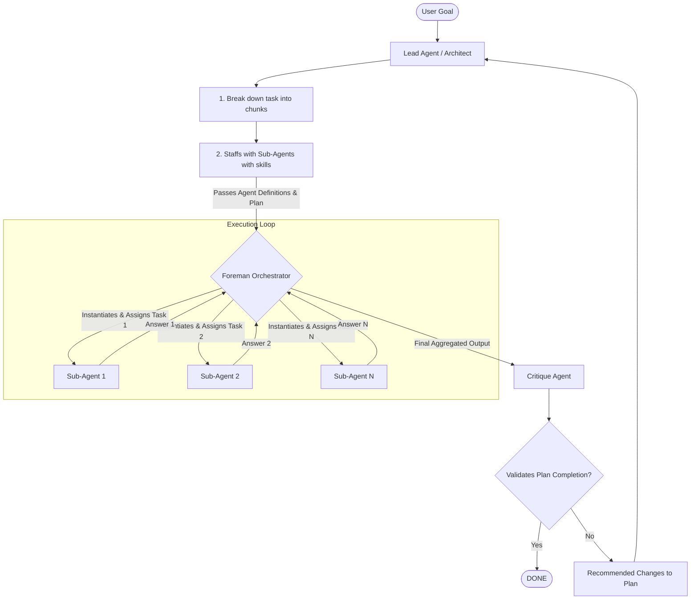

# Design Document: Swarm OS

## 1. Introduction

This document outlines the design for **Swarm OS**. The goal of this framework is to move beyond static, hardcoded multi-agent systems and create a flexible environment where an AI "Architect" can dynamically spawn specialized agents, assign them specific tools, and orchestrate their work to achieve complex goals.

This design incorporates feedback from the user, combining the Architect-Foreman concept with a Lead Agent, Sub-Agents, and a Critique Agent loop.

## 2. Philosophy

The framework is built on a hybrid **Lead Agent / Architect-Foreman** philosophy with iterative critique.

### 2.1 Roles
- **The Lead Agent (Architect)**: This is the strategist. It receives the user goal, breaks down the task into smaller chunks, and **staffs the project** by defining the specific sub-agents needed (name, role, tools).
- **The Foreman (Orchestrator)**: This is the execution engine. It receives the plan and the agent definitions from the Architect. It assigns tasks to the correct agents and manages the communication flow.
- **Sub-Agents**: These are specialized workers created by the Architect to handle specific chunks of the task. They operate with a restricted set of tools.
- **The Critique Agent**: This agent validates the completion of the plan. It reviews the output and either approves it or sends recommended changes back to the Lead Agent for replanning.

### 2.2 Dynamic Swarms
Instead of defining a fixed set of agents at startup, the swarm is fluid.
- Agents are created **just-in-time** based on the specific requirements of the task.
- Tools are assigned to agents dynamically by the Architect.

### 2.3 Agent Creation & Assignment Responsibility [CLARIFIED]
To avoid ambiguity, the responsibilities for dynamic agent management are divided as follows:
- **Architect (Lead Agent) Responsibility**: The Architect is solely responsible for **defining** the agents. It determines the name, role (system instructions), and the list of tools for each sub-agent needed to complete the plan. It passes these definitions as data to the Foreman.
- **Foreman Responsibility**: The Foreman is responsible for **instantiating** the agents. It takes the data definitions from the Architect, creates the actual agent instances in code, and routes the tasks to the appropriate agent instance. The Foreman does not decide *who* to create, only *how* to create and run them.

### 2.4 Human-in-the-Loop (HITL) & Verification
We recognize that LLM planning can be fallible. Therefore, the framework treats **Verification** and **Review** as first-class citizens. Execution can be paused for human approval of plans or critical actions, ensuring safety and correctness.

### 2.5 Session & Storage Management
- **In-Memory Chat**: The framework maintains the chat session in memory during execution. No conversation history is persisted to disk.
- **Shared Workspace**: A dedicated `output/` folder is used for agents to read and write files, acting as a shared scratchpad.

### 2.6 Model & Tool Configuration
The framework uses `gemini-3-flash-preview` as the default model. To support combining built-in tools (like Google Search) with custom function calling in the same chat session, the configuration `include_server_side_tool_invocations=True` must be enabled in `tool_config`.

---

## 3. Architecture Overview

The framework follows a loop of Planning -> Execution -> Critique.

### 3.1 Mermaid Diagram: Architecture

---

## 4. Core Components

### 4.1 Tool Registry
A centralized system to register and describe tools. The Architect uses this to know what skills can be assigned to agents.

### 4.2 The Lead Agent (Architect)
- **Responsibilities**: Goal analysis, context validation, task breakdown, and **agent definition** (passing schemas to Foreman).
- **Output**: A plan containing tasks and the specific agents (with tools) mapped to them.

### 4.3 The Foreman (Orchestrator)
- **Responsibilities**: Takes the plan and agent definitions from the Lead Agent. **Instantiates** the Python representation of the agents. Routes tasks to the appropriate agent instances. Collects results.

### 4.4 Sub-Agents
- **Responsibilities**: Fulfilling specific instructions using the tools provided to them.

### 4.5 Critique Agent
- **Responsibilities**: Quality assurance. Ensures the final output meets the original user goal and is complete.

### 4.6 Output Folder (Workspace)
- **Responsibilities**: A shared directory where agents can read and write files to share data and produce final results.

### 4.7 Frontend Components
- **LogToolbar**: Provides controls for filtering logs by level and date-time range, and downloading logs.
- **LogTerminal**: A brutalist-styled terminal canvas for displaying real-time logs with auto-scroll functionality.
- **Agents Modal**: A detailed view accessible from the Executions page, showing agent definitions and assigned tools.

---

## 5. Execution Flow

1.  **Goal Reception**: User provides a goal (e.g., "I want a todo list app").
2.  **Planning & Staffing**: Lead Agent breaks down the task and generates definitions for Sub-Agent 1, Sub-Agent 2, etc., assigning them tools from the registry.
3.  **Handoff**: Lead Agent passes the plan and agent definitions to the Foreman.
4.  **Execution**: Foreman instantiates agents and assigns tasks. Sub-Agents execute and return answers.
5.  **Critique**: Critique Agent validates the results.
6.  **Loop or Done**: If valid, output is returned to user. If not, recommended changes go back to step 2.

---

## 6. Philosophy on Problems & Challenges

- **Tool Hallucination**: Addressed by isolating tools per agent.
- **Infinite Loops**: The Critique Agent loop must have a maximum iteration limit enforced by the Foreman.
- **Context Management**: Foreman ensures only relevant task context is passed to Sub-Agents.
- **Rate Limiting (429)**: Addressed by implementing exponential backoff retry logic for all Gemini API calls via a shared utility.

---

## 7. Project Structure
- **Root**: Python backend (agents, models, tools, execution).
- **`frontend/`**: Next.js web application for observability and interaction.
- **`output/`**: Shared workspace for swarm runs.
